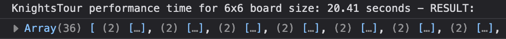
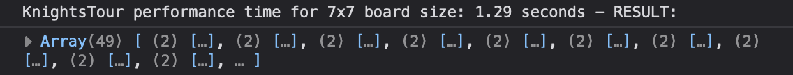
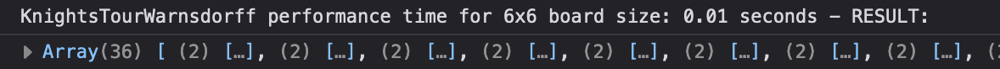
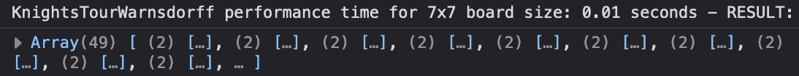
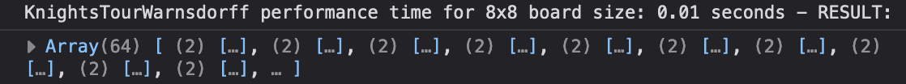
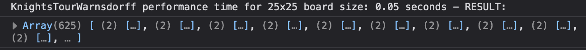

# knights-travails

Finds the shortest possible route for a knight to move from one square to another on a chessboard of variable size N, and returns the Knights path.

# knights-tour

Finds a correct solution for a complete Knight's Tour, a sequence of moves where a knight visits each square on a chessboard of variable size N only once, and returns the Knight's path.

# knights-tour-warnsdorff

Finds a correct solution for a complete Knight's Tour, a sequence of moves where a knight visits each square on a chessboard of variable size N only once, and returns the Knight's path (while significantly improving performance time and reducing memory usage).

## tech-stack

Written in vanilla JavaScript, tests run via Jest, transpiled with Babel & compiled with Webpack

---

### Project Thoughts & Approaches:

- Graphs, graphs, graphs. I'd already been thinking about graphs after recently readying through [Think Like a Git](https://think-like-a-git.net/) and gaining a basic understanding of graph theory. This project pushed me further down the graph rabbit-hole and taught me numerous other methods for initiating a breadth-first search (BFS) traversal within a graph.

  - **Knight's Travails** - this problem is specifically about finding the shortest path within an unweighted graph. After much reading, my approach was actually relatively simple in the end: set up a 2-D array to keep track of the board, create ChessSquare nodes for the starting and ending [x, y] coordinates, initialize a queue and fill it with the starting ChessSquare node, then run the main loop - while the queue is not empty push every `possibleMoves()` for each ChessSquare into the queue with an incremented distance of +1 (removing duplicate values and moves with coords outside the board edges along the way). When the current ChessSquare node in the queue matches the ending [x, y] coordinates, the function will return the length of the path as well as the path coordinates (obtained by backtracing the path from the destination to the origin after completing a travail).

- Time, space, and performance. The other big topic this project got me thinking deeper about was time and space complexity, and in particular how each of those variables impacts performance. This was not such a big issue when it came to the Knight's Travails project, where time complexity is O(N^2) (in the worst case all cells will be visited) and auxiliary space is also O(N^2), because all of the nodes are stored in a queue. However, when I decided to attempt the Knight's Tour problem (purely for my own entertainment), performance quickly became a factor...

  - **Knight's Tour** - after solving the Knight's Travails problem, the Tour is not so difficult (if you are so inclined to do so - this was not part of the Odin curriculum but my mind got curious). In fact, you can recycle the same approach, creating ChessSquare nodes that return an array of `possibleMoves()`, which are then pushed into a queue. With this problem, however, you must go one step further and recursively call the `findPath()` function on each set of [x, y] coordinates returned by `possibleMoves()`. If the current [x, y] coords can possibly lead to a complete tour (if the recursive function call returns true) they are added to the path and returned, otherwise the function moves on to the next set of coordinates and backtracking to complete the process.

  While this approach was successful, it was brutal on computer performance. This is because the Knight's Tour, as implemented so far, is an exponential algorithm, with time and space complexity of O(k^N). Things work pretty well on a 5x5 or a 6x6 board (or even a 7x7), but if we try to do a normal 8x8 chessboard, the computer will run indefinitely if it doesn't outright crash for lack of memory.

  Take a look at the screenshots below to get an idea of the average performance time for the Knight's Tour algorithm:

  
  

  As you can see, the Knight's Tour algorithm takes quite a bit of time and memory to process - 20+ seconds to solve a 6x6 board (even sized boards seem to present more challenges to this original algorithm than the odd sized boards), and 1.5+ seconds on average for a 7x7 board. While seemingly somewhat quick, running a function on a normal 8x8 board will take a normal computer anywhere from 30 minutes to an hour+ to return a result, due to the depth of recursion involved. The one time I got Knight's Tour to run on an 8x8 board it took my computer around 4000 seconds, or 66 minutes, by which point I think I was asleep.

  - **Knight's Tour Warnsdorff** - in an attempt to solve the Knight's Tour problem without relying on an exponential algorithm that would require enormous amounts of time and space, I turned to yet another approach: Warnsdorff's heuristic. Warnsdorff was a German mathematician who lived during the 19th and proposed a novel way for solving the Knight's Tour problem: When looking at the next possible moves, prefer the next move with the fewest possible options. This simple rule has several important impacts: it leads the search down the shortest paths first (less time wasted), it will lead the search along the edges of the board (again wasting less time searching for doomed paths in the middle of the board), and it is less likely to leave orphaned squares.

  Look at these performance screenshots taken while running the Knight's Tour Warnsdorff function:

  
  
  
  

  This new and improved Warnsdorff approach is a significant improvement over the original algorithm! Pretty sweet.

---

Created as part of the free [Odin Project](https://www.theodinproject.com) curriculum
